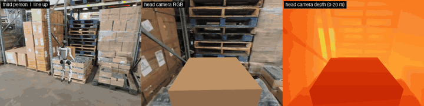
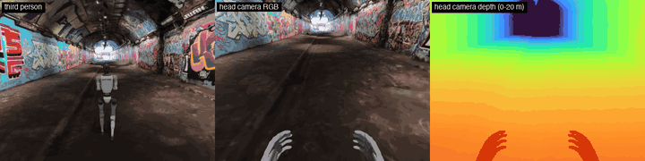
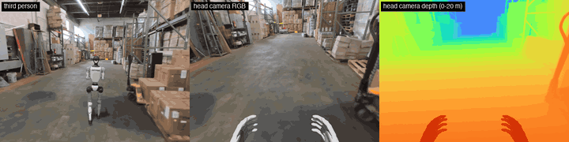
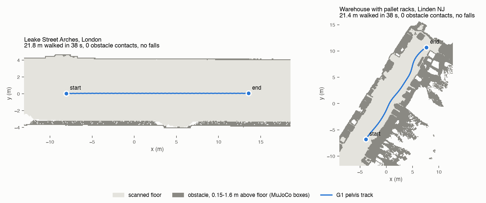
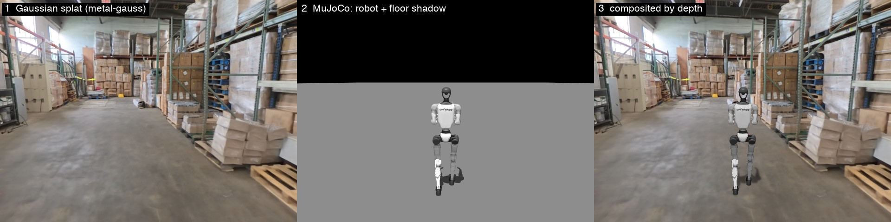
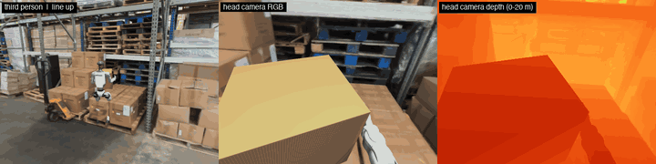
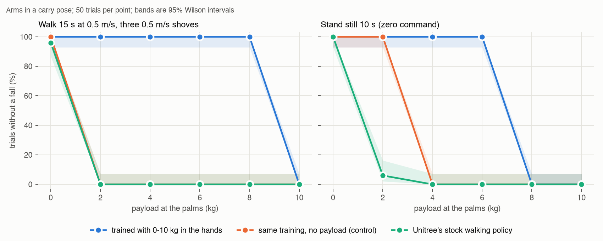
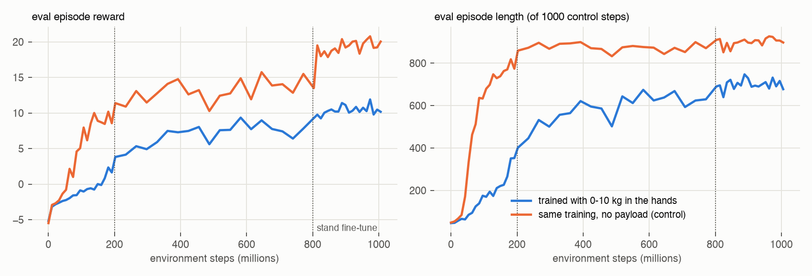

# A Unitree G1 in real places: walking, then carrying a box

A Unitree G1 humanoid in two real-world 3D Gaussian-splat captures: a graffiti tunnel in London and a pallet-rack warehouse in New Jersey. Every clip is recorded from three synchronised cameras: third person, head-camera RGB and head-camera depth.

- **[Part 1](#part-1-walking-through-real-places-0)** walks it through both scans with Unitree's stock policy, on a MacBook, for $0.
- **[Part 2](#part-2-carrying-a-box-127-of-gpu)** trains a walking policy that carries a box. Unitree's stock policy falls in 50 of 50 trials once 2 kg is held at the palms. The retrained one completes 50 of 50 up to 8 kg, and it picks a carton off one real pallet stack and sets it on another. Training cost $1.27.



# Part 1: walking through real places ($0)

The setup this copies is NVIDIA Isaac Sim, Isaac Lab, an RTX GPU and Niantic Spatial's Places Library ([Tim Martin's post](https://www.linkedin.com/posts/tim-martin-176471250_nvidiaomniverse-isaacsim-isaaclab-ugcPost-7512778691396018176-J65_/)). This version runs on an Apple-silicon MacBook with no NVIDIA GPU and no cloud. It costs $0:

- **MuJoCo** runs the physics and draws the robot.
- **[metal-gauss](https://github.com/nandometzger/metal-gauss)** draws the scene on the Mac's GPU.
- **Unitree's own pretrained walking policy** moves the legs.





Full walks: [`media/leake.mp4`](media/leake.mp4), [`media/linden.mp4`](media/linden.mp4) (38 s each).

## Results

| | Leake Street Arches, London | Warehouse, Linden NJ |
|---|---|---|
| Gaussians in the capture | 10,581,232 | 12,774,981 |
| Collision mesh | 0.5 M triangles | 26.7 M triangles |
| Walked | 21.8 m in 38.4 s | 21.4 m in 37.7 s |
| Falls / obstacle contacts | 0 / 0 | 0 / 0 |
| Distance from the planned path, mean / max | 0.06 / 0.12 m | 0.07 / 0.13 m |
| Scale correction needed | **×5.4** (estimated, see below) | none |
| Up axis correction needed | none | **Y-up → Z-up** |
| Floor tilt removed | 0.90° | 0.21° |

Rendering three 480×360 views takes **0.85 s per frame** on an M5 MacBook Pro (32 GB). Each frame needs two splat colour renders, two splat depth renders and ten MuJoCo passes. That works out to about 14 minutes per 38-second walk.



## How a frame is built



1. **Scene.** The USDZ's `.nurec` file is a gzip-compressed msgpack 3DGUT checkpoint. It holds fp16 positions, rotations, log-scales, density logits and degree-3 spherical harmonics. [`g1places/scene.py`](g1places/scene.py) decodes it, and `metal-gauss` rasterises it with its fused Metal kernels.
2. **Robot.** MuJoCo renders the G1 with the scene hidden: colour, depth and a segmentation mask, at 2× resolution then box-filtered for anti-aliased edges.
3. **Shadow.** MuJoCo renders a grey floor plane under a shadow-casting light, once with the robot and once without. The ratio between the two darkens the splat floor where the feet are.
4. **Composite.** A robot pixel wins wherever the robot is closer to the camera than the splat surface.
5. **Depth camera.** Each Gaussian's camera-space z is written into its SH DC coefficient, so the same fused kernel rasterises depth. That's 4× faster than metal-gauss's explicit-colour path (0.27 vs 1.11 s) and agrees with it to the millimetre.

The legs are driven by `deploy/pre_train/g1/motion.pt` from [unitree_rl_gym](https://github.com/unitreerobotics/unitree_rl_gym), with the observation layout, gains and 50 Hz control unchanged. On top of it sits a path follower: it commands forward speed (0.6 m/s) and steers toward a point 1.2 m ahead on an A* path. The path is planned on an occupancy grid built from the collision mesh. The cameras are recorded but not used for control: this is a rendering demo, not a perception policy.

## What the sample files needed

The two free samples don't agree with each other or with their own metadata. Each issue below would have broken a naive import.

**Leake Street is about 5× too small.** In the file, the tunnel is 1.48 units wall to wall and about 1.3 units floor to ceiling, so the 1.3 m robot would barely fit. The tunnel is published as 8 m wide, which gives a scale of 5.4. A second check agrees: the reconstruction origin (most likely the first camera pose) sits 0.33 units above the floor, which is 1.8 m at that scale, a handheld 360-camera height. Linden's origin sits 1.79 m above its floor. Treat the ×5.4 as an estimate, good to perhaps ±20%. The mesh layer also declares centimetres (`metersPerUnit = 0.01`), but its numbers are in the same units as the splat.

**Linden is Y-up inside a Z-up stage.** Both samples author an identity transform on the splat. Leake's splat is Z-up and Linden's is Y-up, so no single convention reads both correctly. Leake's mesh carries a Y→Z rotation; Linden's carries none.

**Neither floor is level.** A robust plane fit to the floor gives a 0.90° tilt for Leake (4.4 cm residual) and 0.21° for Linden (0.5 cm). My first obstacle map for Leake measured height above z=0. The floor rose 14 cm along the walk, so the map turned half the tunnel floor into "walls". Checking those walls against the splat, which showed an empty tunnel there, is what caught it. Each world frame is now levelled from the fit ([`fit_floor`](g1places/collision.py)).

**MuJoCo collides with the convex hull of a mesh.** Loaded as one mesh, the scan becomes a solid lump with the robot inside it. Instead, only geometry 0.15–1.6 m above the levelled floor is kept. It's rasterised to a 10 cm grid and merged into boxes (39 near the Leake path, 419 near the Linden one). The floor is a plane, because the policy was trained on flat ground.

**The splats are never transformed.** Rotating 10 M Gaussians would mean rotating their spherical harmonics too. Instead, each world camera pose is mapped into the file frame (`Scene.world_to_file_pose`), and splat depth is scaled back to metres.

## Limitations

- The walking policy is blind and was trained on flat ground. Steps, ramps and anything under 15 cm aren't modelled.
- Collision is 2.5D: no overhangs, no tables to walk under.
- The robot's brightness is matched to each capture by hand (`robot_gain`), not relit from it.
- Splat depth is alpha-weighted expected depth. It's smooth at edges and floaters, unlike a real stereo depth camera.
- Leake's scale is inferred from one published width plus a camera-height check.
- One walk per scene. No randomisation, no repeated seeds.

## Run it (Part 1)

```bash
scripts/setup.sh        # venv + unitree_rl_gym at a pinned commit (G1 model + policy)

# the two free samples: https://www.nianticspatial.com/en/embodied-ai (download form)
.venv/bin/python scripts/prepare.py leake  ~/Downloads/LeakeStreetArches.usdz
.venv/bin/python scripts/prepare.py linden ~/Downloads/Linden_Warehouse_Pallet_Racks.usdz

.venv/bin/python scripts/simulate.py leake          # plan + walk -> data/leake/walk.npz
.venv/bin/python scripts/render.py leake --range 0 480
.venv/bin/python scripts/render.py leake --range 480 960
.venv/bin/python scripts/render.py leake --encode   # -> media/leake.mp4
.venv/bin/python scripts/figures.py                 # -> media/walk_maps.png
.venv/bin/python scripts/make_media.py gifs         # -> GIFs, loops, posters
.venv/bin/python scripts/make_media.py method       # -> media/how_a_frame_is_built.jpg
.venv/bin/python scripts/check_sh_layout.py linden  # SH coefficient order check
.venv/bin/python -m pytest tests                    # geometry tests, no GPU or data needed
```

Render in foreground chunks. macOS throttled the same GPU job about 7× when it ran as a background process (6 s/frame vs 0.85 s/frame).

# Part 2: carrying a box ($1.27 of GPU)



Full run, 59 s, 4 kg: [`media/linden_carry.mp4`](media/linden_carry.mp4). The robot walks to a real pallet stack in the scan and lines up. It grips and lifts a carton, then carries it 8.7 m up the aisle (31 s holding it in all). It lines up at a second stack, lowers the carton and releases it. The carton ends flat on the stack top (0.0° tilt).

## Result

Each trial holds the arms in a box-carry pose with the payload split between the two palms. 50 trials per point, Wilson 95% bands in the figure.

| Policy | Walk 15 s at 0.5 m/s, 3 shoves of 0.5 m/s | Stand still 10 s |
|---|---|---|
| Unitree's stock policy (`unitree_rl_gym`) | 48/50 at 0 kg; **0/50 from 2 kg on** | 50/50 at 0 kg (wanders 2.6 m), 3/50 at 2 kg, 0 after |
| Same training as mine, no payload (control) | 50/50 at 0 kg; **0/50 from 2 kg on** | 50/50 at 0–2 kg (wanders 4.6 m at 2 kg), 0 after |
| **Trained with 0–10 kg in the hands** | **50/50 at 0, 2, 4, 6 and 8 kg**; 0/50 at 10 kg | **50/50 at 0–6 kg** (wanders 0.15–0.75 m); 0/50 at 8–10 kg |



Walking speed for the payload-trained policy drops from 0.53 m/s empty to 0.37 m/s at 8 kg, against the commanded 0.5. Every policy drifts 2–8°/s in heading when given a zero yaw command, because nothing closes the loop on heading. The demo's path follower closes it.

## What I trained

The base is [MuJoCo Playground's](https://github.com/google-deepmind/mujoco_playground) G1 joystick task (MJX on MuJoCo Warp, Brax PPO, Playground's own hyperparameters). I changed three things ([`train/carry_env.py`](train/carry_env.py)):

- **The arms are not the policy's.** Each episode samples an arm pose: 25% arms down, 75% a mirrored box-carry pose. The 14 arm actuators track that pose whatever the policy outputs. The policy drives legs and waist.
- **A hidden payload.** Each forearm gets a mass at the palm, half of M with M ~ U(0, 10) kg per environment, so the load goes through elbows and shoulders as a squeezed box's would. The actor never observes M; the critic does.
- **A control run** with the identical setup and schedule and M = 0. Both runs got 200M steps, then +600M, then a +200M stand-still fine-tune: 1B steps each.

Training ran on rented RTX 4090s, about 100k env-steps/s and roughly 17 minutes per 200M. Evaluation runs on the Mac in plain MuJoCo, not MJX. My observation code matches the training environment's to 3×10⁻⁸ ([`train/policy.py`](train/policy.py)).



## What went wrong, in order

**The first policy fell whenever it was told to stand still: 0 of 50, even empty-handed.** That was my reward bug. Playground's stand-still penalty sums |q − default| over all 29 joints when the command is zero. I had taken the arms away from the policy and parked them in carry poses, so that penalty was about 2.4 rad of arm deviation the policy could never remove. Every reward is scaled by dt, so the penalty cost about −24 per 500-step stand segment. Terminating cost −2. Falling over was the cheaper option, and the policy found it. Restricting the penalty to the 15 joints the policy controls, plus a 200M-step fine-tune with 25% stand commands, took standing to 50/50 up to 6 kg. It cost something: walking with 10 kg went from 41/50 before the fine-tune to 0/50 after.

**At 200M steps payload training had barely helped.** It managed 3/20 vs 0/20 at 4 kg. The training curve was still climbing, so both runs went to 800M on the same schedule. At 800M the payload policy managed 50/50 up to 6 kg and 41/50 at 10 kg. The control stayed at 0/50 from 4 kg on.

**My first speed metric measured yaw drift.** I took distance along the starting heading over 15 s. The policy actually walked at 0.54 m/s but turned about 130° over the trial, so the metric read 0.23 m/s. It now reports forward speed in the robot's own frame plus heading drift as its own number.

**Unitree's 29-joint G1 file leaves armature, damping and friction at 0** on every joint. The 12-joint file their policy was trained on uses 0.01 / 0.001 / 0.1. On the 29-joint model the stock policy fell in under a second even unloaded until I copied those values over. Its baseline above uses the corrected model.

**Arm-pose randomisation alone buys about 2 kg, then loses it.** The control at 800M walked with 2 kg in 49/50 trials, the stock policy in 0/50. The only difference is that the control trained with random arm poses. The control's stand fine-tune then took that to 0/50.

## The demo, and what it does not show

The demo is a scripted task, one run, not a success rate ([`train/run_carry_demo.py`](train/run_carry_demo.py)). The trained policy drives the legs throughout. On top of it sit:

- a path follower and a line-up controller;
- an arm controller: IK limited to the arm-pose range the policy trained on, gravity and carried-load feed-forward, and a small windowed integral on palm height.

Things to know:

- **The grip is a weld.** Once both palms touch the carton, the carton is welded to them. I tried a pure friction grip with Playground's hands first. Their capsule colliders give two point contacts, which hinge, and the carton swung 24° pitch and 28° roll on them. Flat palm pads then slipped. The weld replaces only the friction. The 4 kg still hangs from the palms, and the policy balances it.
- **The demo carries 4 kg.** At 5 kg it fell during the loaded carry, where it turns while walking. The benchmark only covers straight walking and standing.
- **It picks from the higher stack (top 0.66 m) and places on the lower (0.557 m).** The other way round, the carried carton's underside hung below the 0.66 m top. It hit the stack's front face and the robot couldn't step in.
- **Line-ups need slack.** The policy never fully stands still and under-follows small turn commands (about 0.4–0.7× commanded). Picking needs the robot within 6 cm and 5° of its spot; placing accepts 15 cm and drops the carton straight ahead of wherever the robot stands.
- **The carton is a simulated object composited into the scan.** It is not one of the boxes in the capture, which are baked into the splat.

## Run it (Part 2)

```bash
# training, on a CUDA box (see remote/): Playground + Brax, jax 0.9.2 (brax 0.14.2 needs < 0.10)
uv pip install -r train/requirements.txt "jax[cuda12]==0.9.2"
python train/train.py --max-payload 10 --out runs/payload10                     # 200M
python train/train.py --max-payload 10 --seed 1 --timesteps 600000000 \
       --restore runs/payload10/params.pkl --out runs/payload10_800M
python train/train.py --max-payload 10 --seed 2 --timesteps 200000000 --p-stand 0.25 --stand-fix \
       --restore runs/payload10_800M/params.pkl --out runs/payload10_1B
# the control: the same three commands with --max-payload 0

# evaluation and demo, on the Mac (CPU)
python train/evaluate.py --policy runs/payload10_1B --protocol walk --trials 50
python train/evaluate.py --policy runs/payload10_1B --protocol stand --trials 50
python train/evaluate.py --policy unitree --protocol walk --trials 50
python train/run_carry_demo.py --policy runs/payload10_1B --mass 4
python scripts/render_carry.py --range 0 520     # ... in chunks, then --encode
python scripts/figures_carry.py
```

The final policies are in `runs/payload10_1B/` and `runs/payload0_1B/`, as Brax params with their `meta.json`. Every number above is in `results/`.

# Credits and licences

- **Scenes:** Niantic Spatial, Places Library free samples (Leake Street Arches; Linden Warehouse Pallet Racks). The data isn't redistributed here; download it from Niantic. Renders of the scenes in `media/` are shown for demonstration.
- **G1 model and walking policy:** [unitreerobotics/unitree_rl_gym](https://github.com/unitreerobotics/unitree_rl_gym), BSD-3-Clause, fetched by `scripts/setup.sh`.
- **Splat rasteriser:** [metal-gauss](https://github.com/nandometzger/metal-gauss), MIT.
- **Physics:** [MuJoCo](https://github.com/google-deepmind/mujoco), Apache-2.0.
- **Training base for Part 2:** [MuJoCo Playground](https://github.com/google-deepmind/mujoco_playground) G1 joystick task and [Brax](https://github.com/google/brax) PPO, Apache-2.0; G1 model from [MuJoCo Menagerie](https://github.com/google-deepmind/mujoco_menagerie).
- **Idea:** Tim Martin's Isaac Sim demo of the same pipeline.

Code in this repository: MIT.
